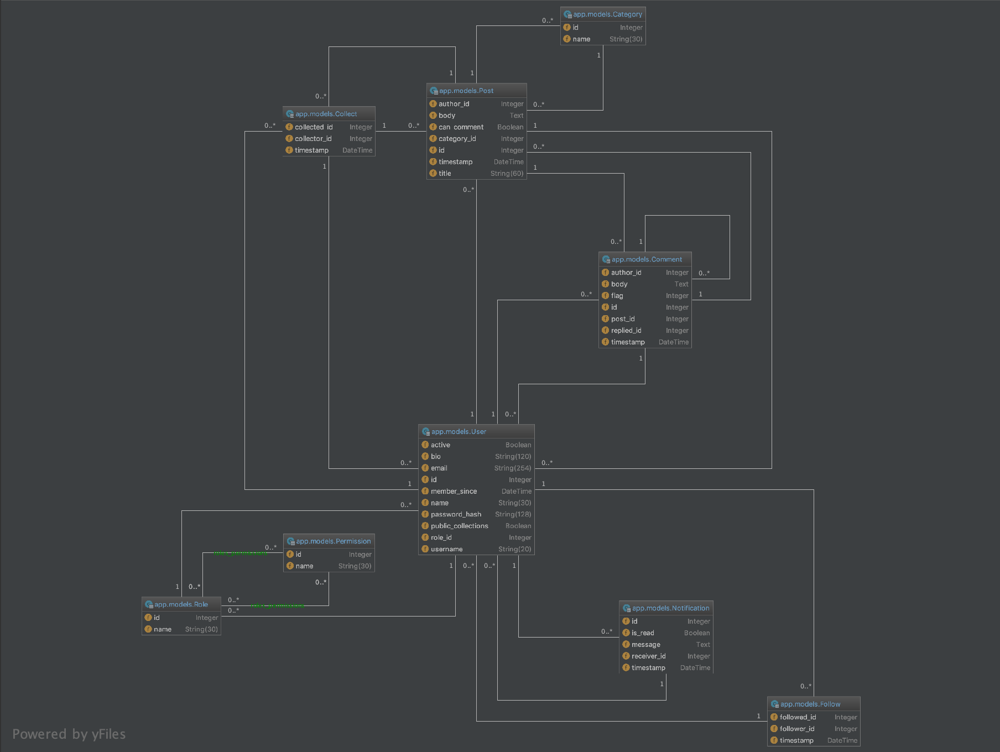

# SHMUBlog
软件项目管理课程-实践作业-博客系统

小组成员:
- 刘哲峰
- 曾科特
- 刘通
- 李鹏飞

## Python 代码风格规范
上传的代码前请按照 [PEP8](https://www.python.org/dev/peps/pep-0008/) 检查代码格式

推荐使用 [Pycharm](https://www.jetbrains.com/pycharm/) 作为编辑器，并设置好代码风格。

## 数据库总体设计



## 项目文件结构说明
    .
    ├── app                 # 项目主体代码
    │   ├── admin           # 管理员模块相关代码
    │   ├── auth            # 认证模块相关代码 
    │   ├── errors          # 错误请求捕获
    │   ├── main            # 网站主页相关代码
    │   ├── post            # 博文相关代码
    │   ├── static          # 静态文件相关（js、css、图标等）
    │   │   ├── css         # css相关文件 
    │   │   ├── js          # javascript 相关文件 
    │   │   └── favicon.ico # 网站图标 
    │   ├── templates       # 前端模版文件
    │   ├── uesr            # 用户相关代码
    │   ├── __init__.py     # 初始化 Flask
    │   ├── commandas.py    # 自定义脚本命令
    │   ├── decorators.py   # 装饰器方法
    │   ├── extensions.py   # Flask 相关拓展库
    │   ├── fake.py         # 各种模拟数据生成方法
    │   ├── models.py       # 数据库相关表单
    │   └── utils.py        # 项目中使用到的工具方法
    ├── docs                # 项目文档
    ├── tests               # 测试代码
    ├── .gitignore          # git 上传忽略配置文件(️如无需要，请勿删除里面的内容)
    ├── config.py           # 项目配置文件
    ├── README.md           # Github 项目描述文件
    ├── requirement.txt     # 项目依赖库
    └── shmublog.py         # 项目实例&运行入口

## 项目开发配置流程
### 环境依赖：
1. Python 3.7.2；
2. Git
3. virtualenv==16.1.0

### 下载代码到本地:
```commandline
git clone https://github.com/hellckt/SHMUBlog && cd SHMUBlog
```

### 建立新的开发分支
> 分支管理按照 [GitGlow](https://www.atlassian.com/git/tutorials/comparing-workflows/gitflow-workflow)
的规范。

开发新模块或者新功能的流程如下：
```commandline
git fetch
git checkout develop && git pull
git branch -b {分支的名字} develop
```

备注：

1. 千万不要直接 push 到 master 或 develop 分支！
2. 功能模块开发完毕后提出 merge 请求到 develop 即可。


### 安装虚拟环境并进入虚拟环境(推荐)
```commandline
virtualenv venv && source venv/bin/activate
```

### 安装依赖
```commandline
pip install -r requirement.txt
```

### 设置配置环境
```commandline
touch .flaskenv
```

添加下列内容到 `.flaskenv`
```
FLASK_APP=shmublog.py
FLASK_ENV=development
FLASK_DEBUG=1
```

### 初始化
```commandline
flask initdb    // 初始化数据库与表单
flask init      // 初始化用户角色与权限
flask fake      // 生成测试数据
```

### 运行
```commandline
flask run
```
或
```commandline
flask run --reload  // 自动重载资源, 开发时使用
```

### 运行单元测试（每次开发完毕都要运行测试！）
```commandline
python -m unittest
```

PS. 之后我会考虑，移植到 Flask command 里。

## 开发任务
- [x] 基础项目框架的搭建
- [x] 项目基础开发文档
- [x] 基础项目框架的单元测试
- [x] 认证模块
- [x] 总体数据库设计
- [x] 认证模块的单元测试
- [x] 用户模块P1功能
- [x] 用户模块P1功能的单元测试
- [x] 用户模块P2功能
- [x] 博文模块
- [x] 管理员模块
- [x] 网站主页
- [x] 自定义头像
- [ ] 用户模块P2的单元测试
- [ ] 用户模块P3功能
- [ ] 用户模块P3的单元测试
- [ ] 博文模块的单元测试
- [ ] 管理员模块的单元测试
- [ ] 网站主页的单元测试
- [ ] 页面美化（图标、图片、等）
